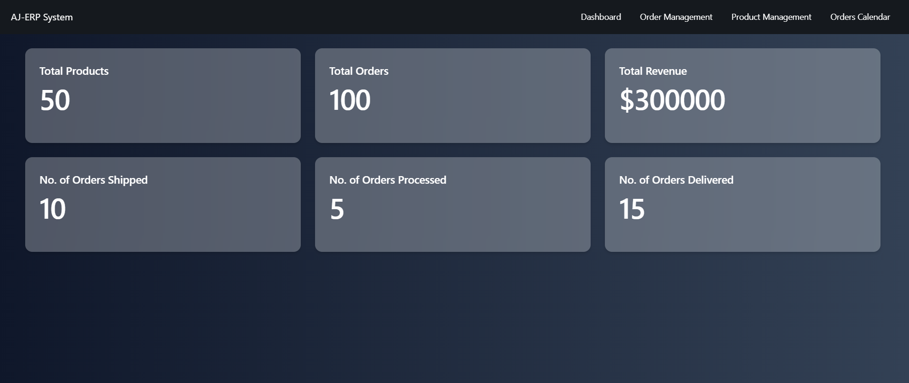
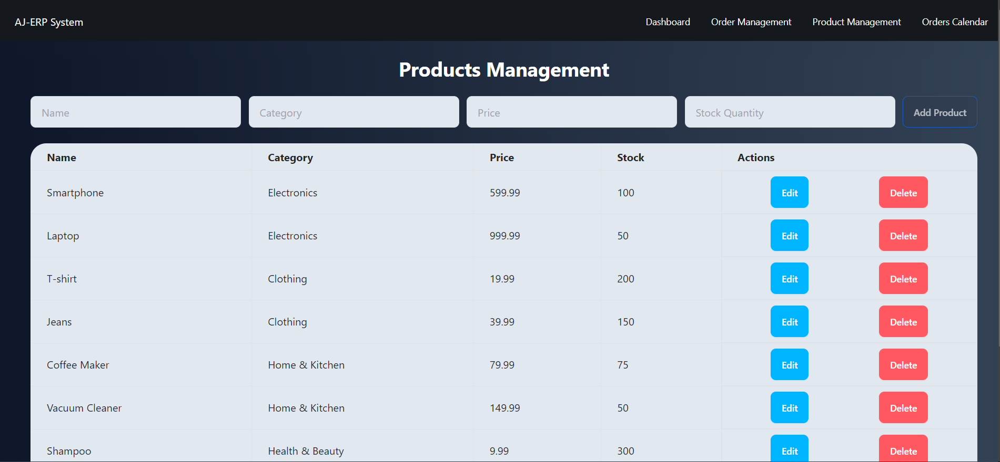
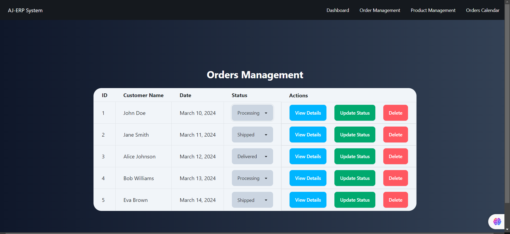
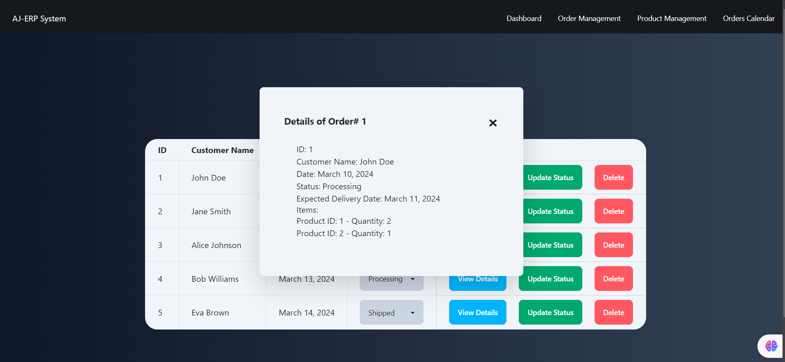
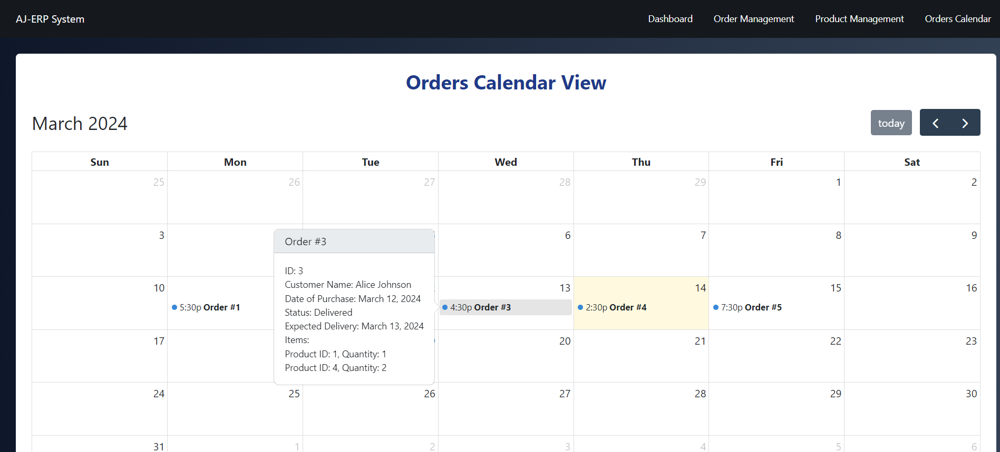

# ERP System - [https://aj-erpsystem.netlify.app/](https://aj-erpsystem.netlify.app/)

The goal of this project is to create a simplified interface for an ERP (Enterprise Resource Planning) system, designed to manage basic business operations efficiently. The system will consist of the following pages:
-   Dashboard - Provides an overview of the system's features.
-   Products Management - Allows for the management of product listings.
-   Orders Management - Facilitates viewing and handling orders.
- Orders Calendar View - A calendar interface displaying orders based on their expected     	delivery dates.
>*Note- The mock data has been created and stored in JSON format ( in *orders.json* and *products.json* files).*

## Features

-   Add new products with details such as name, category, price, and stock quantity.
-   Edit existing product details.
-   Delete products from the list.
-   Basic form validation to ensure all fields are filled before submitting.
- Calendar interface displaying orders based on their expected delivery dates.

## Installation and Setup 

To run the project locally, follow these steps:

1.  Clone the repository to your local machine:
    
    
    `git clone https://github.com/AJSteel01/react-admin-Dashboard.git` 
    
2.  Navigate to the project directory:

    `cd assignment-erp` 
    
3.  Install dependencies:
    
    `npm install` 
    
4.  Start the development server:
    
    `npm run dev` 
    
5.  Open your browser and go to http://localhost:5173 to view the application.    

## Project Screenshots

- Dashboard Page -

- Product Management Page -

- Order Management Page -

- Order Calendar View Page -

## Technologies Used

-   React.js
-   Tailwind

